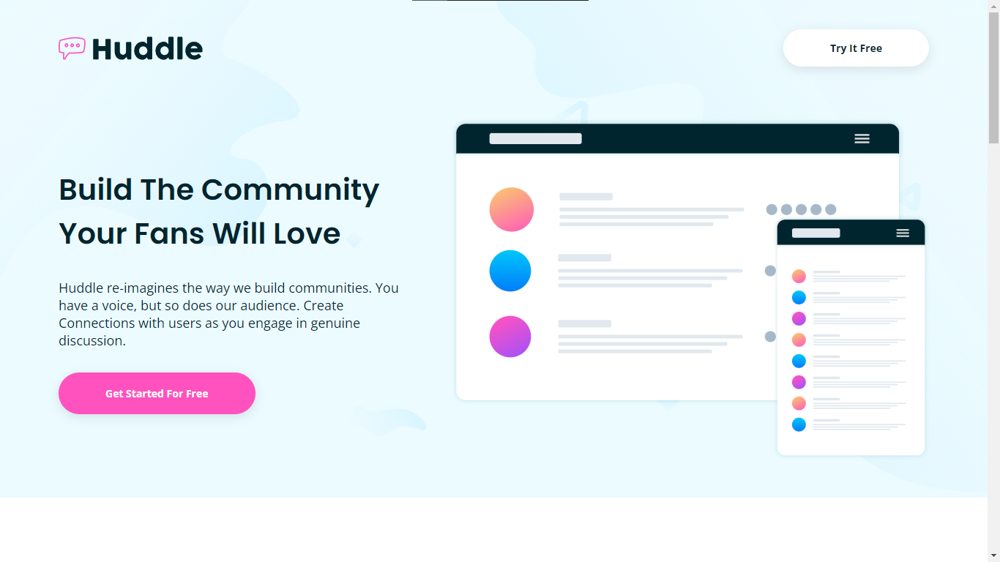

# Frontend Mentor - Huddle landing page with alternating feature blocks solution

This is a solution to the [Huddle landing page with alternating feature blocks challenge on Frontend Mentor](https://www.frontendmentor.io/challenges/huddle-landing-page-with-alternating-feature-blocks-5ca5f5981e82137ec91a5100). Frontend Mentor challenges help you improve your coding skills by building realistic projects. 

## Table of contents

- [Overview](#overview)
  - [The challenge](#the-challenge)
  - [Screenshot](#screenshot)
  - [Links](#links)
- [My process](#my-process)
  - [Built with](#built-with)
  - [What I learned](#what-i-learned)
  - [Continued development](#continued-development)
- [Author](#author)

## Overview

### The challenge

Users should be able to:

- View the optimal layout for the site depending on their device's screen size
- See hover states for all interactive elements on the page

### Screenshot

### Links

<!-- - Solution URL: [Solution-URL](https://your-solution-url.com) -->
- Live Site URL: [Live-Site](https://huddle-landing-page-with-alternating-blocks-one.vercel.app/)

## My process

### Built with

- Semantic HTML5 markup
- SASS
- Flexbox
- BEM Naming Conventions

### What I learned

I learned how to use BEM naming conventions also I used 7-1 pattern for the first time for SASS. Also I never built a website before so It was a great experience to work on this project.

### Continued development

I will try to improve my CSS skills and avoid writing unnecessary code.

## Author

- Frontend Mentor - [@AmazingDude](https://www.frontendmentor.io/profile/AmazingDude)
- Twitter - [@AmazingDudeFN](https://www.twitter.com/AmazingDudeFN)
